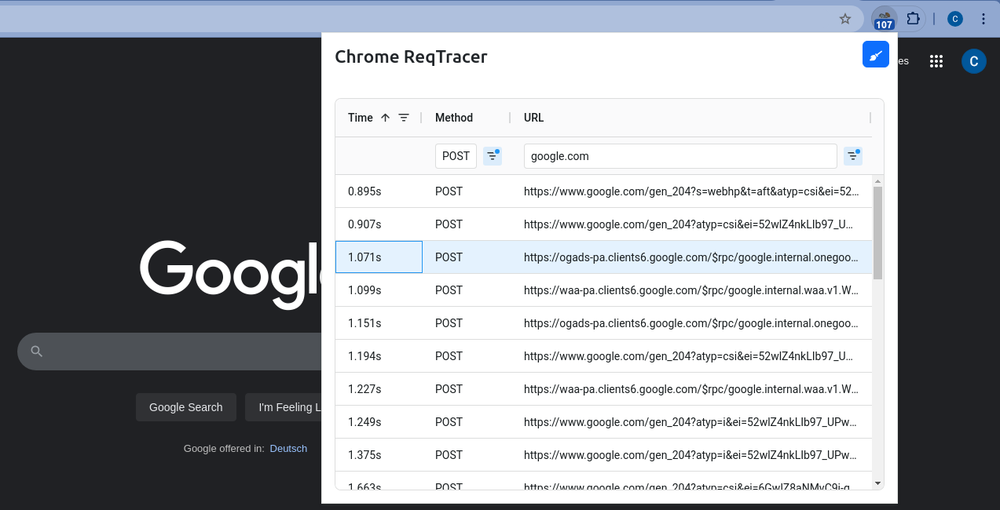

# Chrome ReqTracer

A simple Chrome extension for tracing the requests of tabs. Implementation for an application test task.

Uses TypeScript, vite, Chrome Extension API, React, Bootstrap, Font Awesome, AG-Grid, and Playwright for testing.

*Discover how many places your favorite websites are calling home!* 



## Installation

1. Go to the [releases section](https://github.com/LinqLover/chrome-reqtracer/releases), download `chrome-reqtracer.zip` from the latest release, and extract it in a permanent location.
2. In Chrome, go to [chrome://extensions/](chrome://extensions/) and ensure <kbd>Developer mode</kbd> in the top right corner is enabled.
3. Click <kbd>Load unpackaged</kbd> in the top left corner and choose the extracted directory.
4. Voila, you can now find the **Chrome ReqTracer** in the extensions menu at the top right corner of Chrome! Optionally, you can right-click or drag it to pin it next to the address bar.

## Usage

Browse and interact with any website you like and watch how the counter of traced requests increases. Requests are always traced for all tabs and displayed lively for the active tab.

You can click on the extension icon to view a list of all sucessful requests.

- Use the broom icon (🧹) to clear the list and reset the counter.
- You click on table headers to change the sorting of requests, resize table columns, or filter the requests through the available options.
- As the current tab performs further web requests (e.g., when hovering the "I'm feeeling lucky" button of Google at the time of writing), the list will automatically update.

## Settings (experimental)

Some settings for the extension can be configured in [`src/settings.ts`](./src/settings.ts). Please refer to the comments in the file for more information. In the future, these settings might be exposed to the user through the popup or an options page.

## Development

### Setup

```bash
npm install
```

### Building

```bash
npm run build

# Or for continuous building
# npm run watch
```

### Testing

```bash
npx playwright install
npm run test
```

## Package Structure

- [`.github/workflows/`](./.github/workflows/): GitHub Actions for CI/CD.
- [`assets/`](./assets/): Icons.
- [`src/`](./src/): Source code of the extension.
    - [`popup/`](./src/popup/): React components for the popup.
      - [`App.tsx`](./src/popup/App.tsx): Main component of the popup.
      - [`RequestList.tsx`](./src/popup/RequestList.tsx): Component for the list of requests.
	- [`types/`](./src/types/): Utility type definitions.
	- [`background.ts`](./src/background.ts): Background worker of the extension. Traces web requests, updates the extension badge, and communicates with popups.
	- [`popup.html`](./src/popup.html): HTML entry point of the popup.
	- [`popup.tsx`](./src/popup.tsx): React entry point of the popup. Displays the list of requests.
	- [`support.ts`](./src/support.ts): Type definitions and utility functions for communication between the background worker and popups.
- [`src-minimal/`](./src-minimal/): Minimal version of the extension to demonstrate simplicity. Excludes popups, types, and debugging support. No build required.
- [`tests/`](./tests/): Playwright tests.
	- [`fixtures/`](./tests/fixtures/): Test fixtures.
		- [`resources/simpleDataLoader/`](./tests/fixtures/resources/simpleDataLoader/): A simple HTML/JS page that loads data.
		- [`SimpleDataLoader.ts`](./tests/fixtures/SimpleDataLoader.ts): POM for the simple data loader.
		- [`SimpleDataLoader.spec.ts`](./tests/fixtures/SimpleDataLoader.spec.ts): Playwright test for the simple data loader.
	- [`objects/`](./tests/objects/): POMs/object models for the extension.
		- [`ExtensionInfo.ts`](./tests/objects/ExtensionInfo.ts): Object model for the extension icon (not actually a POM but in the same vein).
		- [`ExtensionPopup.ts`](./tests/objects/ExtensionPopup.ts): Object model for the extension popup.
	- [`vendor/`](./tests/vendor/): Vendor scripts for Playwright.
	- [`extension.spec.ts`](./tests/extension.spec.ts): Playwright test for the extension.
	- [`fixtures.ts`](./tests/fixtures.ts): Playwright test fixtures.
- [`manifest.json`](./manifest.json): Metadata of the extension.
- [`vite.config.ts`](./vite.config.ts): Vite configuration for building TypeScript and React.
